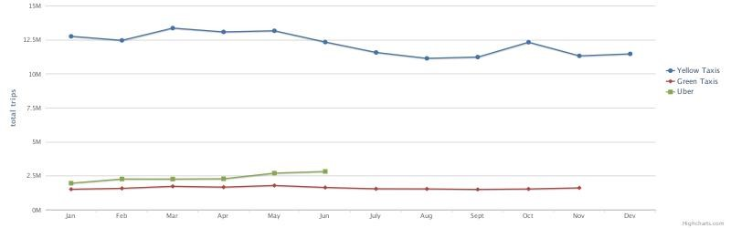
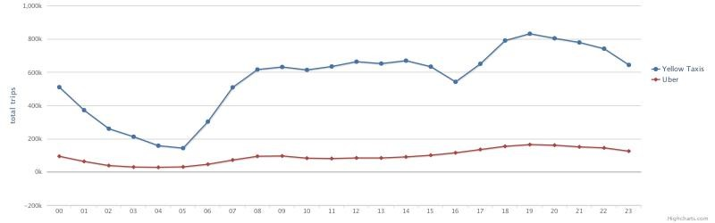
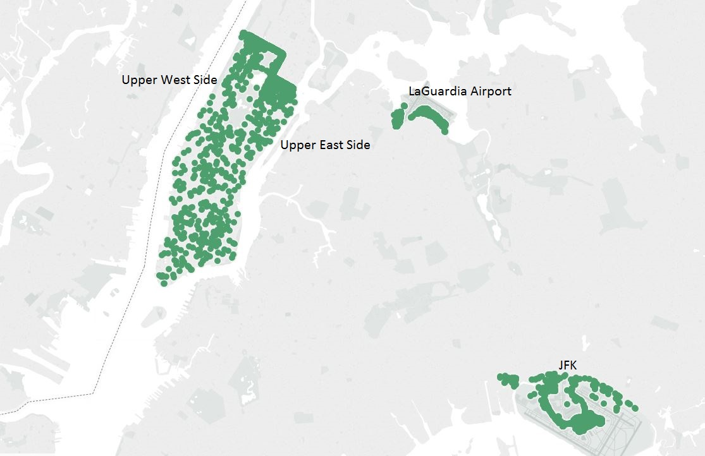
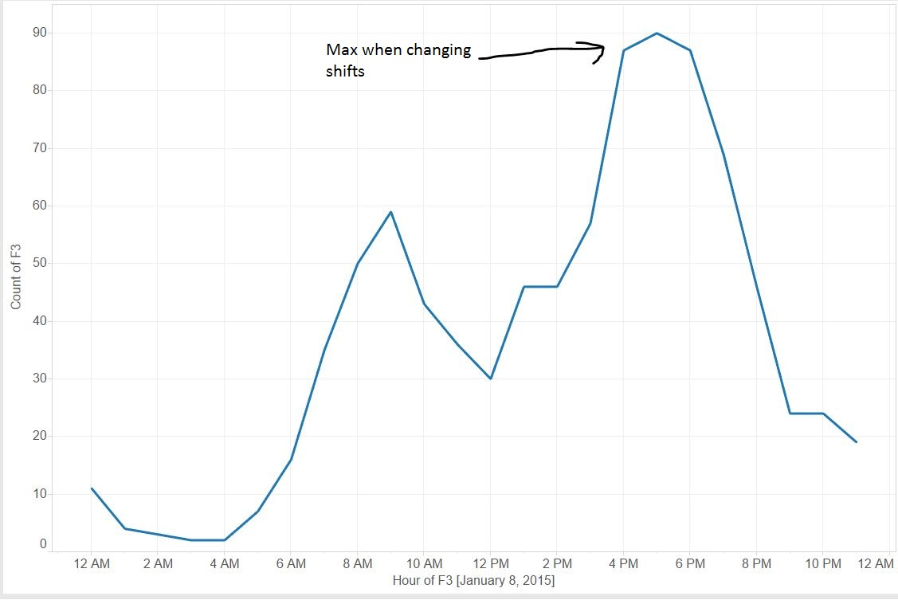
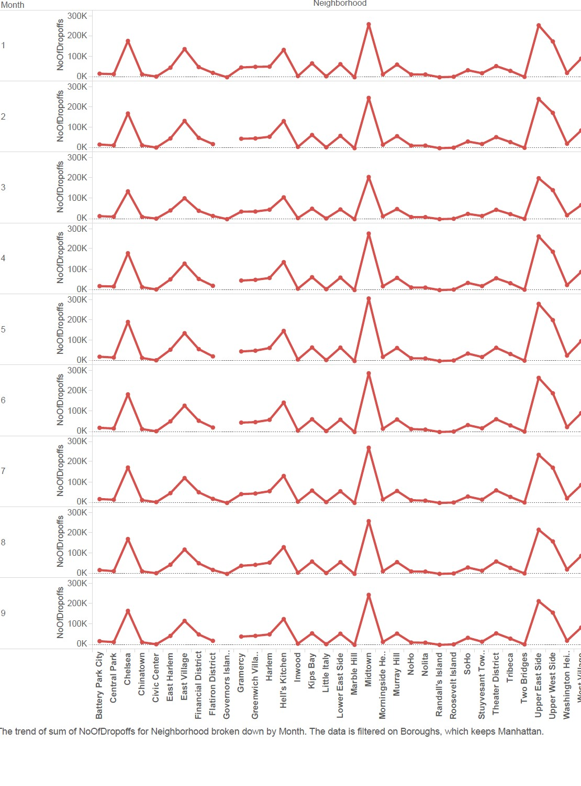
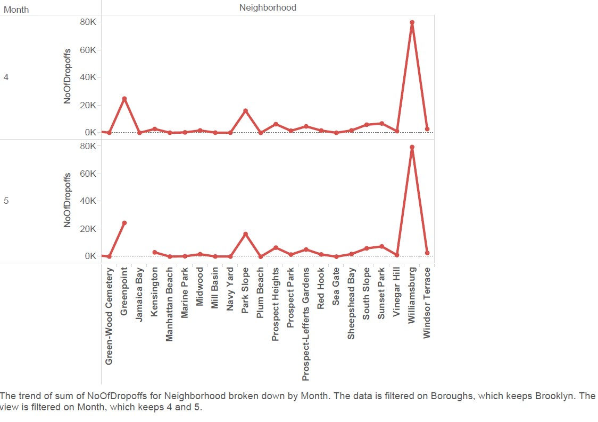

# NYC-TAXI-DATA ANALYSIS

# <h4>Case Studies</h4>
1. Illegal Taxi pickups
2. NYC Nightlife
3. TPEP(Taxicab Passenger Enhancements Program) (We used the store_and_fwd flag which says that if there is no network connectivity then the trip details are stored in the cab local memory)

# <h4>Observations</h4>
1. Dip in the number of taxi(NYC Yellow taxi) trips at 4 P.M
2. We saw a reduction in the number of taxi(NYC Yellow taxi) trips in the months of June-August.

# <h4>Data Source</h4>
1. Taxi Data(we used year 2015 data) http://www.nyc.gov/html/tlc/html/about/trip_record_data.shtml
2. Uber data https://github.com/fivethirtyeight/uber-tlc-foil-response

# Results
Trips/Month. See the Dip from July-August. This was because of the strike against Uber  
      

Trips/Hour. See the dip at 4PM. NYC cabs shift change occurs at this time.  
    

Plot of all illegal green(boro) taxi pickups 
    
    

Plot of manhattan night life 
    

Plot of brooklyn night life 
    

# Authors 
Deepesh Nathani  
Sanya Pooniwala
